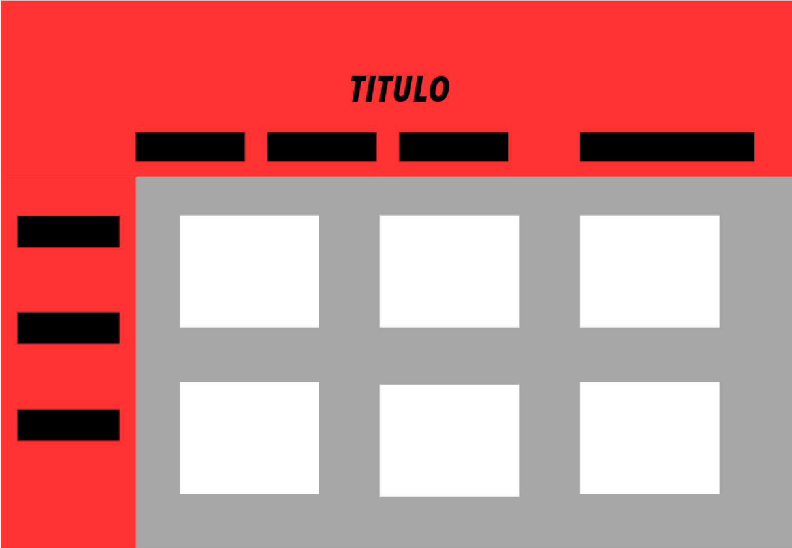
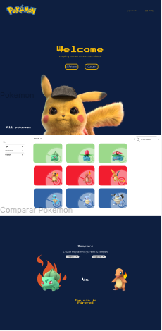
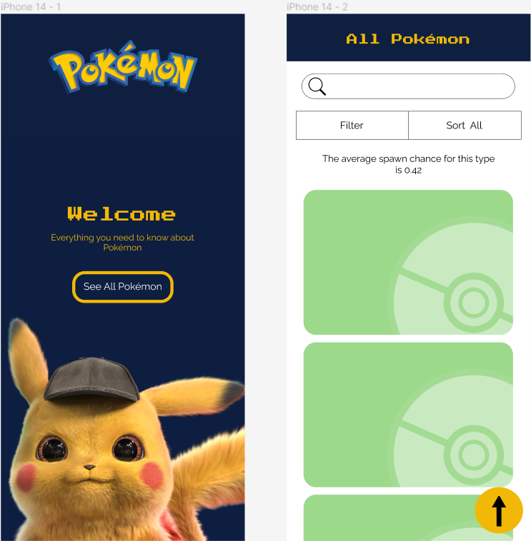
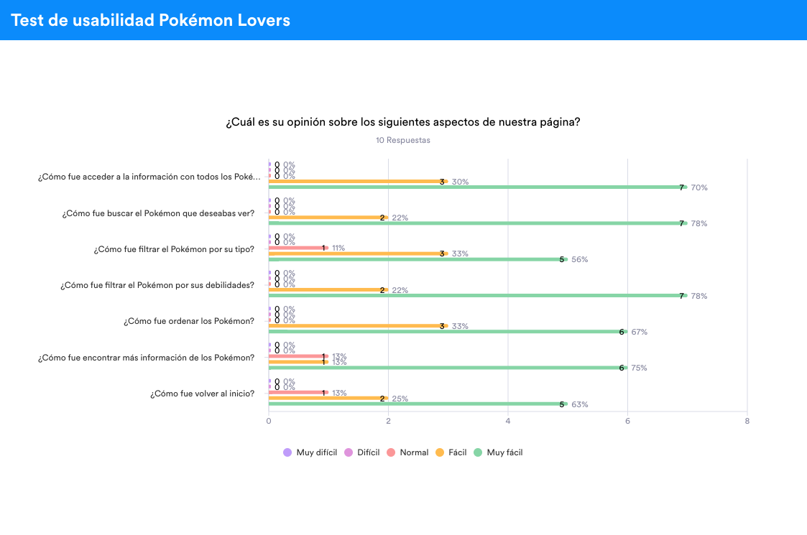

# Pokémon Lovers

## Índice

* [1. Definición del producto](#1-definición-del-producto)
* [2. Historias de usuario](#2-historias-de-usario)
* [3. Prototipos de baja fidelidad](#3-prototipos-de-baja-fidelidad)
* [4. Prototipos de alta fidelidad](#4-prototipos-de-alta-fidelidad)
* [5. Resultados test de usabilidad](#5-resultados-de-test-de-usabilidad)
* [6. Conclusión](#conclusion)
 
***

## 1. Definición del producto

[Pokémon Lovers](https://andressasrodrigues.github.io/DEV009-data-lovers/src/) es un sitio web dedicado a los amantes de Pokémon, donde los usuarios pueden buscar, explorar y conocer las características de diferentes Pokémon. El sitio web está diseñado para brindar una experiencia interactiva y educativa, permitiendo a los usuarios filtrar los Pokémon por tipo y debilidades, ordenarlos alfabéticamente y realizar búsquedas por nombre.

### Características principales
Visualización de Pokémon: Los usuarios pueden explorar una amplia selección de Pokémon, donde se muestra información esencial como el nombre y los tipos de cada uno.

* Filtrado por tipo y debilidades: Los jugadores principiantes y experimentados pueden filtrar los Pokémon según su tipo y debilidades, lo que les ayuda a tomar decisiones estratégicas al elegir el mejor Pokémon para una batalla.

* Orden alfabético: Los Pokémon se pueden ordenar de forma ascendente y descendente según sus nombres, lo que facilita la búsqueda y comparación de diferentes especies.

* Búsqueda por nombre: Los usuarios pueden utilizar la función de búsqueda para encontrar rápidamente un Pokémon específico ingresando su nombre.

### Público objetivo
El sitio web está dirigido a personas aficionadas a Pokémon y a aquellos que disfrutan jugar en línea a través de sus dispositivos móviles y ordenadores. Desde nuevos jugadores que desean aprender sobre los Pokémon hasta jugadores experimentados que buscan información detallada para tomar decisiones estratégicas, el sitio web ofrece un recurso valioso para todos los niveles de experiencia.

### Tecnologías utilizadas
El proyecto utiliza HTML y CSS para la estructura y el diseño del sitio web. Además, se implementan funciones interactivas utilizando JavaScript para permitir la filtración, ordenación y búsqueda de los Pokémon. Los datos se importan y se gestionan mediante técnicas de manipulación de objetos y arrays en JavaScript.

## 2. Historias de usuario

### Historia de usuario 1 (Newbie)

Yo Juan, como nuevo jugador, quiero visualizar los diferentes tipos de Pokémon, para comenzar a jugar.

#### Criterios de aceptación:
* El usuario al ingresar a la aplicación encontrará el vector que corresponde a algunos de los Pokémon.
* El usuario visualizará la información de sus principales características: nombre y tipos.

#### Definición de terminado: 
* El código pasa los test necesarios (Uso de HTML semántico y CSS).
* Se importó correctamente la data.
* La página web es responsive.

### Historia de usuario 2 (Beginner) 

Yo Ana, como jugadora principiante, quiero filtrar el Pokémon por tipo y debilidades, para elegir el mejor Pokémon en batalla.

#### Criterios de aceptación:
* El usuario podrá visualizar un menú de navegación que le brinde la opción de filtrar por tipo y debilidades.
	
#### Definición de terminado:
* El código de la función “Filter Data” pasa los test.

### Historia de usuario 3 (Intermediate)

Yo Pedro, como jugador nivel intermedio, quiero ordenar los Pokémon por su nombre de forma ascendente y descendente, además de buscar por nombre.

#### Criterios de aceptación:
* El usuario podrá ordenar los Pokémon de forma ascendente y descendente de acuerdo a sus nombres.
* El usuario podrá buscar el nombre del Pokémon específicamente.

#### Definición de terminado:
* Tener un menú en la parte superior de las tarjetas con la opción para ordenar.
* El usuario encontrará el input para buscar en la parte superior de las tarjetas.
* El código de la función “Sort Data” pasa los test.
* El código de la función “Search Filter” pasa los test.

### Historia de usuario 4 (Master)

Yo Magdalena, necesito saber el chance de aparición de los diferentes Pokémon por su tipo.

#### Criterios de aceptación:
* El usuario al filtrar por tipo los Pokémon podrá visualizar el promedio de aparición.

#### Definición de terminado:
* Que la función “Compute” pase los test.
* Tener un mensaje con el promedio por cada tipo.

## 3. Prototipos de baja fidelidad

* Prototipo desktop

En el primer prototipo, decidimos que al entrar al sitio web, los usuarios podrán ver los Pokémon disponibles. Además, implementamos dos tipos de menús para facilitar la navegación:

**Menú lateral de filtrado:** Los usuarios pueden utilizar este menú para filtrar los Pokémon según diferentes criterios, como tipo y debilidades. Esto les permite encontrar rápidamente Pokémon específicos que se ajusten a sus necesidades o preferencias.

**Menú superior de ordenación:** También hemos incluido un menú en la parte superior de la página que permite a los usuarios ordenar los Pokémon en función de diferentes criterios. Esto les brinda la posibilidad de organizar la lista de Pokémon de acuerdo a sus preferencias, ya sea en orden alfabético ascendente o descendente.

* Prototipo móvil

En la versión móvil, al ingresar al sitio web, los usuarios son recibidos con una pantalla de bienvenida que incluye un botón para acceder a la sección con todos los Pokémon. Una vez en esta sección, en la parte superior de la página, los usuarios encontrarán los menús de filtrado y ordenación, junto con una barra de búsqueda.

## 4. Prototipos de alta fidelidad

* Prototipo de alta desktop

* Prototipo de alta móvil 

* Los prototipos de alta fidelidad se encuentran en [Figma](https://www.figma.com/proto/T8V1bKQldSdh1GO2vHcCWA/pokemon?type=design&node-id=431-87&t=xtNfN9Ti9PuCTVeA-1&scaling=min-zoom&page-id=0%3A1&starting-point-node-id=431%3A87&show-proto-sidebar=1&mode=design).

## 5. Resultados de test de usabilidad

Para realizar los tests de usabilidad, se usó la página real. Esto nos permitió evaluar la experiencia del usuario con la versión funcional del sitio web de Pokémon. Al trabajar con la página real, pudimos obtener retroalimentación más precisa y relevante, ya que los participantes interactuaron con las características y funcionalidades reales del sitio.

El objetivo del test de usabilidad fue evaluar la facilidad de uso y la experiencia del usuario en nuestro sitio web de Pokémon. Durante el test, se le pidió a un grupo de participantes que realizaran una serie de tareas específicas, como buscar un Pokémon por su nombre, filtrar los Pokémon por tipo y debilidades, y ordenarlos alfabéticamente. Se observaron y registraron las interacciones de los participantes, así como sus comentarios y retroalimentación.

### Metodologia

Utilizamos la herramienta **Jotform** para llevar a cabo el proceso de prueba. Hemos creado un formulario titulado "Test Pokémon Lovers" que se puede encontrar en el siguiente enlace: [Test Pokémon Lovers](https://form.jotform.com/231796850498675)

### Preguntas realizadas

* ¿Cómo fue acceder a la información con todos los Pokémon?
* ¿Cómo fue buscar el Pokémon que deseabas ver?
* ¿Cómo fue filtrar el Pokémon por su tipo?
* ¿Cómo fue filtrar el Pokémon por sus debilidades?
* ¿Cómo fue ordenar los Pokémon?
* ¿Cómo fue encontrar más información de los Pokémon?
* ¿Cómo fue volver al inicio?

Los resultados del test de usabilidad revelaron que la mayoría de los participantes encontraron el sitio web intuitivo y fácil de usar. Sin embargo, se recibieron comentarios sobre la necesidad de proporcionar más información sobre los Pokémon en las tarjetas de visualización. A continuación se encuentra la gráfica de las respuestas correspondientes y el link del reporte completo.

[Reporte completo](https://form.jotform.com/231796850498675)

